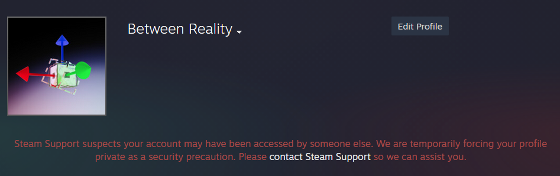

EDIT: This file is obsolete. Technically it is still the competition version of the map, but the initial version of the workshop map is identical. I will only update the map there at this point.
https://steamcommunity.com/sharedfiles/filedetails/?id=3252271329


## Old. Stop reading.
### Or don't. It's all the same to me. All a part of the joke. And believe me, I will be laughing at every second of your inevitable life, from the moment we fade in until the moment I say: Happily Ever-

Steam screwed my account so I have to upload this here. Check the discord competition channel for a message with more details. I'll upload it to steam as soon as possible. For now though, just put the map in the maps folder and load it manually using the console.

The actual map description is this:

```
Originally made for the Portal Mapping and Modding Discord Server "Redemption Arc" Competition (with sub-choice as "Halloween")
Inspired by "The Office Prank" series by Allison Ghost

Story: 
You are Cara Langley, an employee of Aperture Science in the 1950s. One day she wakes up on the floor of a dilapidated office, with no memory as to how she got here.


Okay, so, this map is not complete to how I would have liked it. I decided it was a good idea to start work on the map midway into the competition, and it took me a lot longer to complete than I thought, so I ended up not being able to implement everything. Below is a list of things that I didn't get to finish.
 
 - Fixing projected textures. They weren't working, like at all, for some reason (except for 1), but I never had time to debug it
 - Color correction implementation
 - Custom models, specifically player model. I changed the colors at least, because it was the quickest option
 - Building cubemaps. It wasn't working, and I ran out of time
 - Some miscellaneous final stuff that would be a spoiler
 - Some other stuff I forgot (I am still on a time limit as I write this)
```


Actually, here is just the whole discord message quoted:

"

Okay, so this kinda sucks. All of a sudden I'm getting "Steam Support suspects your account may have been accessed by someone else. We are temporarily forcing your profile private as a security precaution.", which means I can't upload the map. It's already dangerously close to the deadline, which means I don't think I'll be able to get it on steam in time. Because the map is basically finished though, I will upload it somewhere else as a fallback, assuming Steam doesn't fix this within the next 2 minutes.

"

Proof, by the way:


Also yeah I know that there are some security vulnerabilities on my end if i'm even getting that message. I *thought* I fixed that, but apparently Steam decided to screw me over an hour before the deadline.
